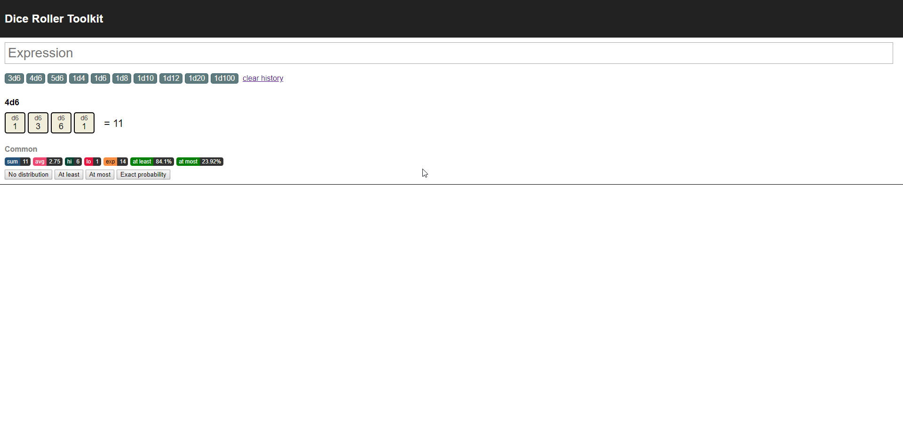

# Dice Roller Toolkit

Dice Roller Toolkit is exactly what it sounds like. It's a dice roller with a small toolkit for visualizing the probabilities of rolls. It can be used when dice are not readily available, or if you want more feedback about the statistics of a given roll. For a more in-depth toolkit into just the probabilities, I recommend the excellent [anydice.com](https://anydice.com/) tool.

Dice Roller Toolkit is designed for speed of use. You can write a dice expression such as '2d6+3d8' and press enter. It will immediately roll the dice and add this expression to a quick roll history, so you can repeat that same roll easily.



## Quick start

This project was kickstarted using [create-react-app with TypeScript](https://github.com/Microsoft/TypeScript-React-Starter). You need node installed to run it. To get started in development mode, clone this repository and cd into the directory. Then run:

```shell
npm install
npm start
```

This will expose the dice-roller on port 3000.

If you want to run the test, you can do so by running (after running install):

```shell
npm test
```

### Docker

There is also a dockerfile included. If you have docker installed, you can run:

```shell
npm run build-docker
docker run -it -p 5000:5000 dice-roller
```

This will expose the dice-roller on port 5000.

## Features

- Write a dice expression and roll it pressing enter.
- Previous expressions are shown as buttons for quick re-rolling.
- See quick stats about the roll: sum, average, highest, lowest, probability (at most, at least).
- See the detailed distribution graph for exactly this roll, at most and at least.
- Everything happens on the client; there is no backend. Collaborative features might change that in the future.

## Possible improvements

- Add a constant to the roll.
- Complex logic (for example, roll 4d6 and discard the lowest)
- Special dice (Fate dice, dice with symbols, repeated sides, etc.)
- Keyboard shortcuts.
- Shared session of dice rolling.
- Mobile version.

## Development progression

This is mainly a hobby project, and I have no idea whether it has any appeal to gamers, who generally appreciate the tactile experience of rolling actual dice. I thought it would be interesting to make, especially as I wanted to try out developing React with TypeScript.

If it matures to a state I consider useful enough, I will publish it to a public domain.

I only have the time to keep the development at low intensity. To speed up development and elevate the ambitions of the project, it would require collaborators.

## Contributions

I accept pull requests after review, and the review will require that:

- The TS lint configuration is respected.
- Non-components / library classes are unit tested.